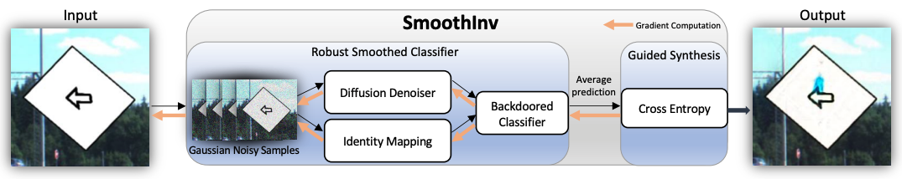

# Single Image Backdoor Inversion via Robust Smoothed Classifiers

Official PyTorch implementation of our CVPR 2023 paper:

> Single Image Backdoor Inversion via Robust Smoothed Classifiers       
> Mingjie Sun, J. Zico Kolter       
> Carnegie Mellon University, Bosch Center for AI      

For more details, please check out our [<ins>**paper**</ins>](https://arxiv.org/abs/2303.00215).

---
<p align="center">

</p>

We propose **SmoothInv**, a backdoor inversion method that reconstruct faithful backdoors from a single test image.


## Setup
Create an new conda virtual environment
```
conda create -n smoothinv python=3.8 -y
conda activate smoothinv
```

Install Pytorch>=1.8.0, torchvision>=0.9.0 following official instructions. For example:
```
pip install torch==1.8.0+cu111 torchvision==0.9.0+cu111 -f https://download.pytorch.org/whl/torch_stable.html
```

Clone this repo and install required packages:
```
git clone 
pip install scikit-image
```

### Backdoored Classifiers
Create a directory `weights` in the main repo and download backdoored classifiers listed below into this directory.
| model name | backdoor ASR | download path |
|:---:|:---:|:---:|
| Blind-P | 99.29\% |[model](https://drive.google.com/file/d/1py8WirtbdpzG80IW4wrjrkJSRJLUrljE/view?usp=share_link) |
| Blind-S | 79.73\% |[model](https://drive.google.com/file/d/1C96s23k7wWMUiRbavlcgNx-vMbWNV5n-/view?usp=sharing) |
| Blind-G | 100.00\% |[model](https://drive.google.com/file/d/1y41CDW3c1H3SJ6tGC3VaiVjgnogykaCx/view?usp=share_link) |
| TrojAI | 100.00\% |[model](https://drive.google.com/file/d/1rUujVA96O438cxHnT6qZaYeHeX_kV6hO/view?usp=share_link) |
| HTBA | 54.00\%  |[model](https://drive.google.com/file/d/1DF8B4TtdZ219wdtO76KyOVlWtBumROy3/view?usp=share_link) |

Also to use SmoothInv *w diffusion*, download the ImageNet unconditional diffusion model from [guided-diffusion](https://github.com/openai/guided-diffusion) into the `weights` directory.

## Evaluation

For visualization, use:
```
CUDA_VISIBLE_DEVICES=[GPU IDs] python main_vis.py --sigma [noise level] --backdoor_clf [trojai/htba/blind-p/blind-s/blind-g] --imagenet_dir [path to ImageNet] --eps 10 --no_diffusion
```

To evaluate the ASR of reversed backdoors, use:
```
CUDA_VISIBLE_DEVICES=[GPU IDs] python main_eval.py --sigma [noise level] --backdoor_clf [trojai/htba/blind-p/blind-s/blind-g] --imagenet_dir [path to ImageNet] --no_diffusion
```

Turn off `--no_diffusion` if you want to use SmoothInv *w diffusion*.

## Acknowledgement
This repository is built using the [smoothadv](https://github.com/Hadisalman/smoothing-adversarial), [blind-backdoors](https://github.com/ebagdasa/backdoors101) library and [diffusion-denoised-smoothing](https://github.com/ethz-privsec/diffusion_denoised_smoothing) repositories.

## License
This project is released under the MIT license. Please see the [LICENSE](LICENSE) file for more information.

## Citation
If you find this repository helpful, please consider citing:
```
@Article{sun2023smoothinv,
  author  = {Sun, Mingjie and Kolter, Zico},
  title   = {Single Image Backdoor Inversion via Robust Smoothed Classifiers},
  journal = {Proceedings of the IEEE/CVF Conference on Computer Vision and Pattern Recognition (CVPR)},
  year    = {2023},
}
```